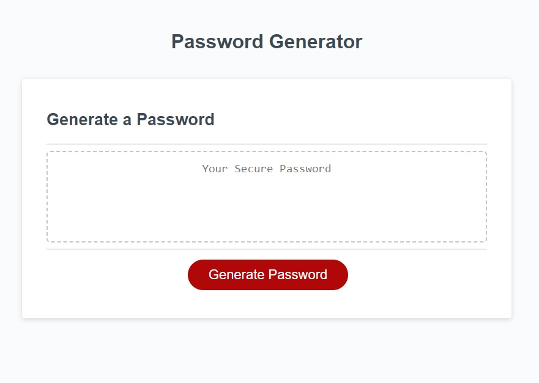

# Password Generator

## Description

This web app can be used to generate a random password of 8-128 characters of your choosing. I built this application using JavaScript to put what I've been learning into action and really test myself to build a working app with logical operators and conditional statements.

## Installation

N/A

## Usage

To use this application simply press the generate button and follow the on screen prompts. Your custom password will appear in the box once all conditions have been met!  
  
Click here to visit my deployed app => https://jradmorrison.github.io/password-generator/

## License

Please refer to the license in the root folder.
